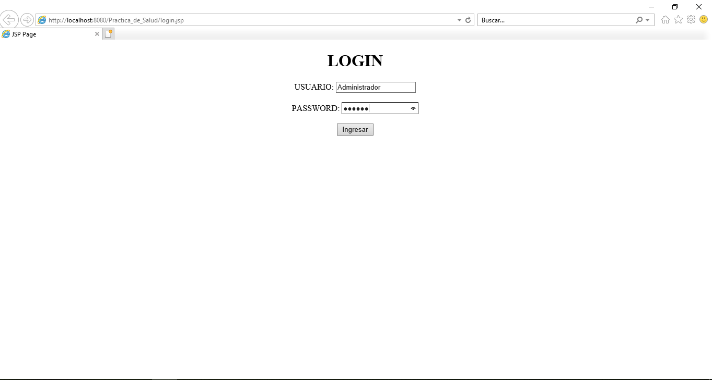
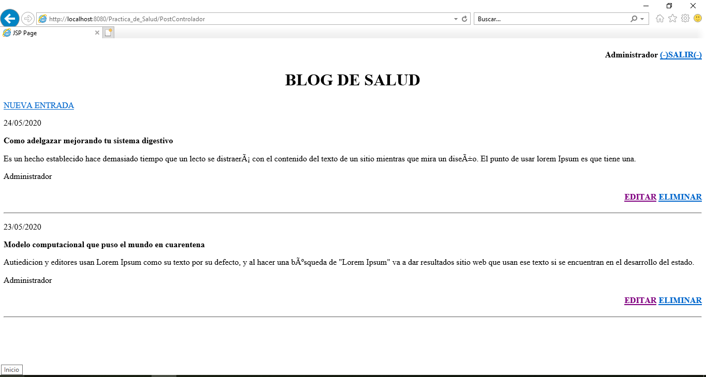
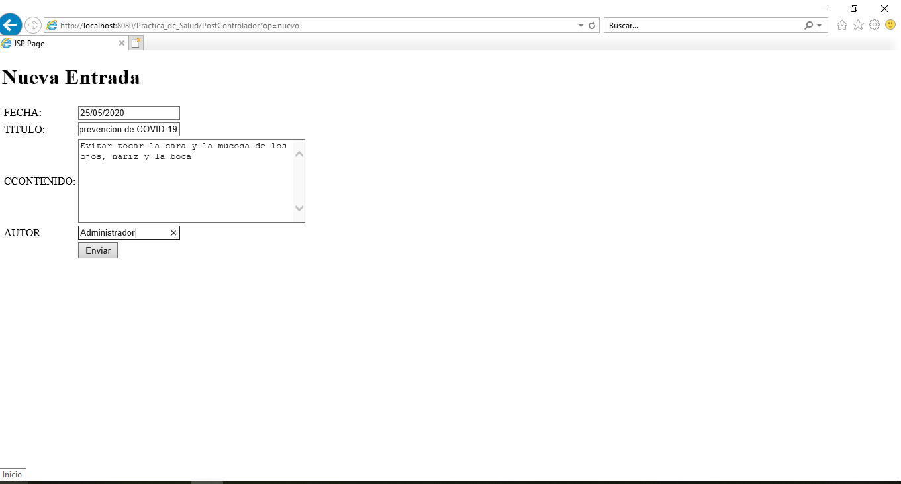
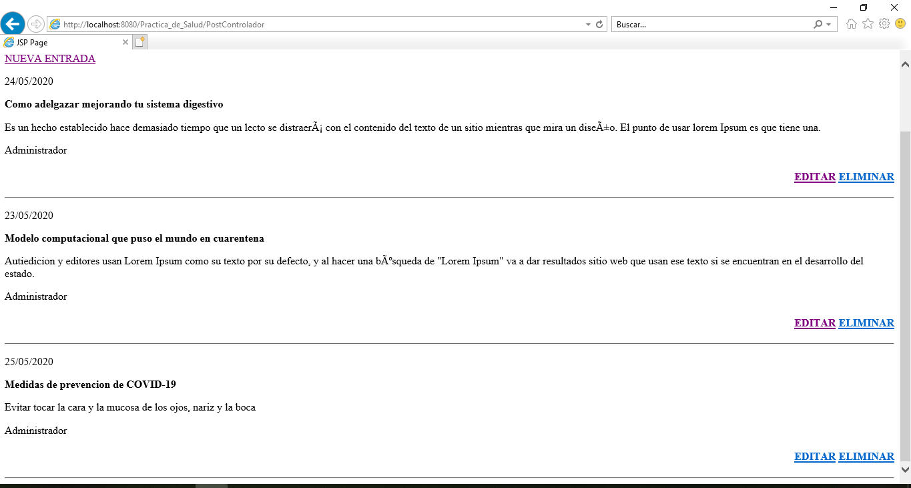
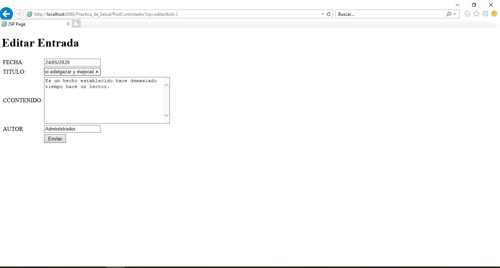
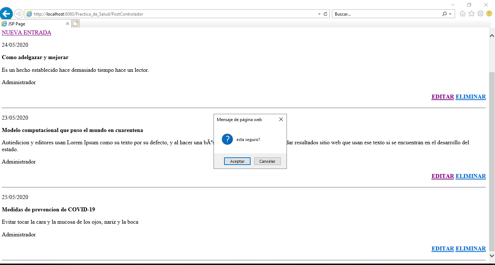
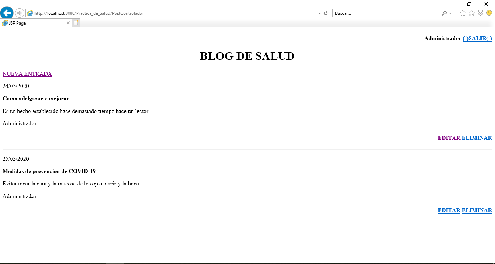
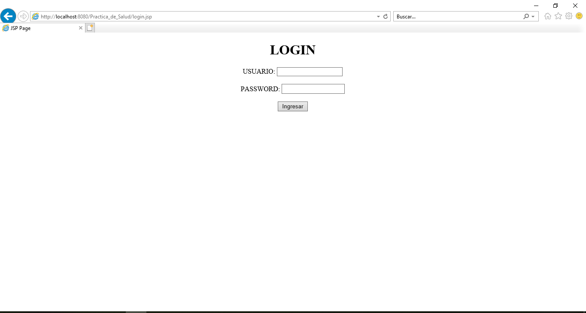

# PRACTICA NRO 4

# ELBIS GONZALO MAMANI CASPA
# CI 7048585 LP 
# RU 200009254

# MYSQL bd_salud
# Un blog es un sitio web en el que se va publicando contenido cada cierto tiempo en forma de articulos(también llamados posts) ordenados por fecha de publicación, asi el artículo mas reciente aparecerá primero.
# Desarrollar una aplicación Web para gestionar un Blog. La aplicación debe contar con una página de autrnticación de usuario que debe ser verificada en una tabla de base de datos:

#También, una interfaz para desplegar post y las operaciones de Nuevo, Editar y eliminar post:

#Asi mismo, para el funcionamiento de la aplicación debe considerar
#1. Creación de base de datos y las tablas necesarias para e proyecto
#2. Mecanismo de conexión de la base de datos
#3. Moddelo, Vistas y Controladores para el funcionamiento del proyecto.

